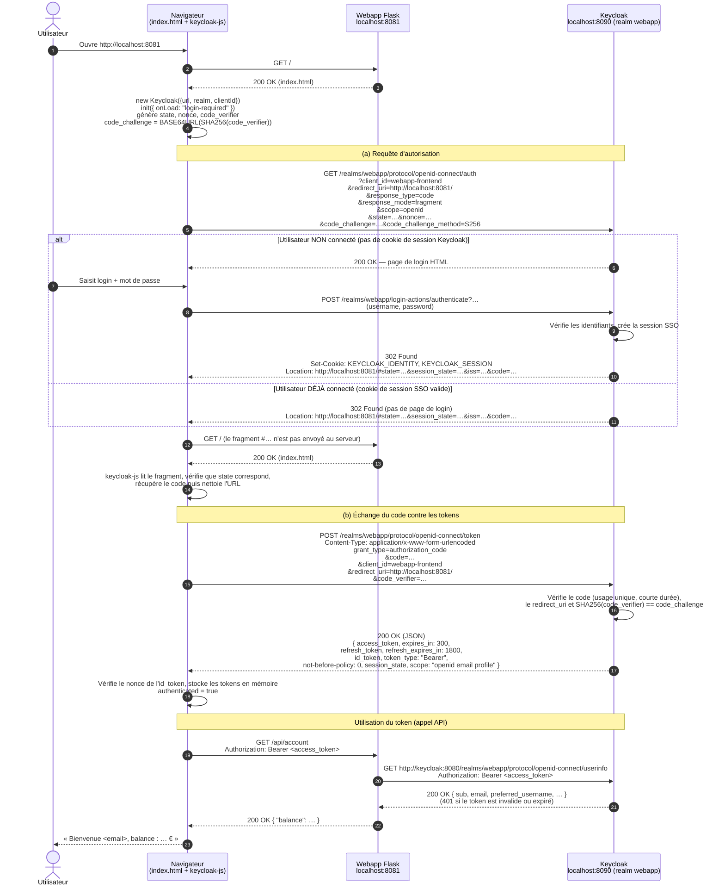

# Question 20 – Diagramme de séquence : Standard flow (Authorization Code + PKCE)

> Keycloak est exposé sur `http://localhost:8090` dans notre environnement (le sujet utilise `8080`).
> Les URLs ci-dessous utilisent donc `8090` ; seul le port change.

## Diagramme

## (a) Requête `GET …/openid-connect/auth`

| Paramètre | Valeur | Rôle |
|---|---|---|
| `client_id` | `webapp-frontend` | Client Keycloak qui demande l'authentification (client public, sans secret). |
| `redirect_uri` | `http://localhost:8081/` | Adresse où Keycloak renvoie le navigateur. Elle doit correspondre aux *Valid redirect URIs* (`http://localhost:8081/*`). |
| `response_type` | `code` | Indique le Standard flow : Keycloak renvoie un **code d'autorisation**, pas un token. |
| `response_mode` | `fragment` | Le code est renvoyé dans le fragment `#…` de l'URL, donc jamais envoyé au serveur Flask. |
| `scope` | `openid` | Demande une authentification OpenID Connect, qui produit un `id_token`. |
| `state` | valeur aléatoire | Protection CSRF : keycloak-js vérifie qu'il retrouve la même valeur au retour. |
| `nonce` | valeur aléatoire | Protection contre le rejeu : la valeur est recopiée dans l'`id_token`, puis vérifiée. |
| `code_challenge` | `BASE64URL(SHA256(code_verifier))` | PKCE : empêche un tiers qui intercepterait le code de l'utiliser. |
| `code_challenge_method` | `S256` | Méthode de hachage PKCE. |

**Code HTTP de la réponse :**
- **Utilisateur non connecté** : `200 OK`, avec la page de login de Keycloak. L'envoi du formulaire (`POST …/login-actions/authenticate`) renvoie ensuite `302 Found` vers `redirect_uri#state=…&session_state=…&iss=…&code=…` et pose les cookies de session SSO.
- **Utilisateur déjà connecté** (cookie `KEYCLOAK_IDENTITY` valide) : `302 Found` directement vers `redirect_uri#…&code=…`, sans demander d'identifiants.

## (b) Requête `POST …/openid-connect/token`

Paramètres envoyés dans le corps `application/x-www-form-urlencoded` :

| Paramètre | Valeur | Rôle |
|---|---|---|
| `grant_type` | `authorization_code` | Échange d'un code d'autorisation contre des tokens. |
| `code` | code reçu à l'étape (a) | Code à usage unique, valable très peu de temps (environ 1 minute). |
| `client_id` | `webapp-frontend` | Doit être le même client que celui de la requête `/auth`. |
| `redirect_uri` | `http://localhost:8081/` | Doit être identique à celui de la requête `/auth`. |
| `code_verifier` | valeur aléatoire générée au départ | PKCE : Keycloak vérifie que `SHA256(code_verifier)` est égal au `code_challenge` reçu. |

> Pas de `client_secret`, car `webapp-frontend` est un client public (*Client authentication* → OFF).

Contenu de la réponse (`200 OK`, JSON) :

| Champ | Contenu |
|---|---|
| `access_token` | JWT à envoyer à l'API dans `Authorization: Bearer …`. |
| `expires_in` | Durée de validité de l'access token en secondes (300 s par défaut). |
| `refresh_token` | Token permettant d'obtenir un nouvel access token sans se reconnecter. |
| `refresh_expires_in` | Durée de validité du refresh token en secondes (1800 s par défaut). |
| `id_token` | JWT décrivant l'identité de l'utilisateur (email, nom, …) pour le frontend. |
| `token_type` | `Bearer`. |
| `not-before-policy` | Date avant laquelle les tokens sont refusés (révocation). |
| `session_state` | Identifiant de la session SSO Keycloak. |
| `scope` | Scopes accordés (`openid email profile`). |
