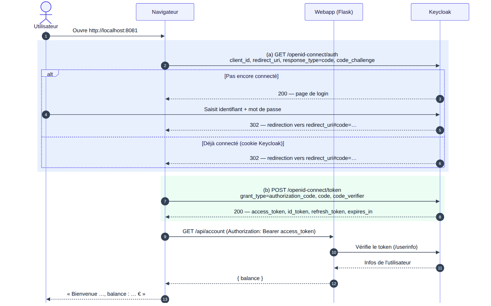

# Question 20 – Standard flow

> Dans notre environnement, Keycloak tourne sur le port `8090` (le sujet utilise `8080`).

## (a) `GET /realms/webapp/protocol/openid-connect/auth`

Le navigateur est redirigé vers Keycloak pour que l'utilisateur s'authentifie.

| Paramètre | Rôle |
|---|---|
| `client_id=webapp-frontend` | Le client Keycloak qui demande la connexion. |
| `redirect_uri=http://localhost:8081/` | L'adresse où Keycloak renvoie l'utilisateur une fois connecté. |
| `response_type=code` | On demande un **code d'autorisation**, pas directement un token. |
| `scope=openid` | Connexion OpenID Connect : on recevra aussi un `id_token`. |
| `state` | Valeur aléatoire vérifiée au retour, contre les attaques CSRF. |
| `code_challenge` | PKCE : empreinte d'un secret (`code_verifier`) que seul le navigateur connaît. |

**Réponse :**
- **pas encore connecté** : `200` avec la page de login, puis `302` vers `redirect_uri#code=…` une fois le formulaire envoyé ;
- **déjà connecté** (cookie de session Keycloak) : `302` directement vers `redirect_uri#code=…`.

## (b) `POST /realms/webapp/protocol/openid-connect/token`

Le navigateur échange le code contre les tokens.

| Paramètre | Rôle |
|---|---|
| `grant_type=authorization_code` | On échange un code d'autorisation. |
| `code` | Le code reçu en (a), à usage unique et valable environ 1 minute. |
| `client_id`, `redirect_uri` | Identiques à ceux de la requête (a). |
| `code_verifier` | Le secret PKCE : Keycloak vérifie qu'il correspond au `code_challenge`. |

Pas de `client_secret` : `webapp-frontend` est un client public.

**Réponse `200` (JSON) :**

| Champ | Contenu |
|---|---|
| `access_token` | Le JWT envoyé à l'API dans `Authorization: Bearer …`. |
| `expires_in` | Durée de validité de l'access token (300 s). |
| `refresh_token` | Permet d'obtenir un nouvel access token sans se reconnecter (valable 1800 s). |
| `id_token` | Identité de l'utilisateur (email, nom…), destinée au frontend. |
