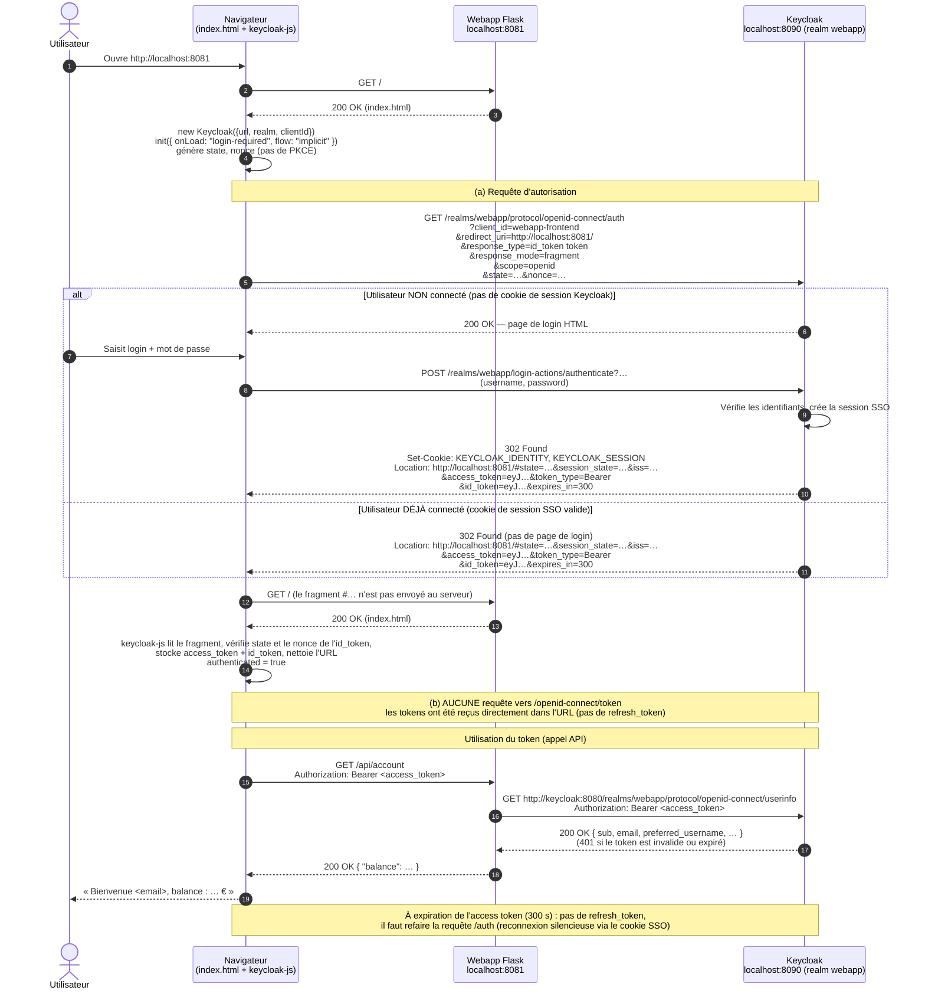

# Question 23 – Diagramme de séquence : Implicit flow

> Keycloak est exposé sur `http://localhost:8090` dans notre environnement (le sujet utilise `8080`).
> Configuration : client `webapp-frontend` avec *Implicit flow* coché (et *Standard flow* décoché),
> et `keycloak.init({ onLoad: "login-required", flow: "implicit" })`.

## Diagramme

## Les 2 requêtes étudiées en Standard flow

### (a) `GET …/openid-connect/auth` : toujours présente, avec d'autres paramètres

| Paramètre | Standard flow | Implicit flow |
|---|---|---|
| `client_id` | `webapp-frontend` | `webapp-frontend` |
| `redirect_uri` | `http://localhost:8081/` | `http://localhost:8081/` |
| `response_type` | `code` | **`id_token token`** : on demande directement les tokens |
| `response_mode` | `fragment` | `fragment` |
| `scope` | `openid` | `openid` |
| `state` / `nonce` | oui | oui (le `nonce` est obligatoire en implicit) |
| `code_challenge` (PKCE) | oui | **non** : il n'y a pas de code à protéger |

**Codes HTTP :** les mêmes qu'en Standard flow.
- Utilisateur non connecté : `200` avec la page de login, puis `302` après l'envoi du formulaire.
- Utilisateur déjà connecté : `302` direct.

La différence est dans le contenu du `Location` de la redirection. Il contient directement
`access_token`, `id_token`, `token_type`, `expires_in` (avec `state`, `session_state`, `iss`),
au lieu d'un simple `code`.

### (b) `POST …/openid-connect/token` : n'existe plus

Il n'y a aucun échange de code contre des tokens, puisque les tokens arrivent dès la redirection de l'étape (a). Conséquences :
- **pas de `refresh_token`** : à l'expiration de l'access token, il faut repasser par `/auth` ;
- les tokens circulent **dans l'URL**, où ils peuvent se retrouver dans l'historique du navigateur, dans le header `Referer`, ou être lus par une extension ou un script injecté (XSS) ;
- pas de PKCE, donc aucune preuve que l'application qui reçoit les tokens est bien celle qui les a demandés.
