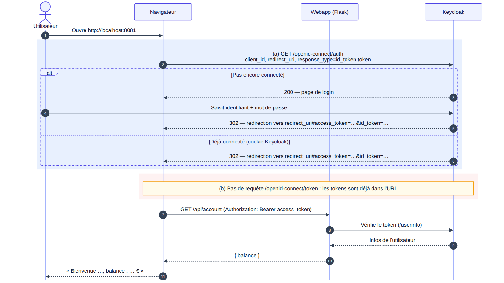

# Question 23 – Implicit flow

> Configuration : client `webapp-frontend` avec *Implicit flow* activé à la place de *Standard flow*,
> et `keycloak.init({ onLoad: "login-required", flow: "implicit" })`.

## (a) `GET /realms/webapp/protocol/openid-connect/auth` : toujours là, mais différente

Les paramètres sont les mêmes qu'en Standard flow, à deux différences près :

| | Standard flow | Implicit flow |
|---|---|---|
| `response_type` | `code` | `id_token token` : on demande **directement les tokens** |
| `code_challenge` (PKCE) | oui | non, il n'y a pas de code à protéger |

Les codes HTTP sont les mêmes : `200` (page de login) puis `302`, ou `302` direct si déjà connecté.
Mais la redirection contient maintenant les tokens eux-mêmes :
`redirect_uri#access_token=…&id_token=…&expires_in=300` au lieu de `#code=…`.

## (b) `POST /realms/webapp/protocol/openid-connect/token` : disparaît

Les tokens arrivent dès l'étape (a), il n'y a donc plus d'échange de code. Conséquences :
- **pas de `refresh_token`** : quand l'access token expire, il faut repasser par `/auth` ;
- **les tokens passent dans l'URL** : ils peuvent fuiter (historique du navigateur, script malveillant…) ;
- **pas de PKCE** : rien ne prouve que l'application qui reçoit les tokens est celle qui les a demandés.
