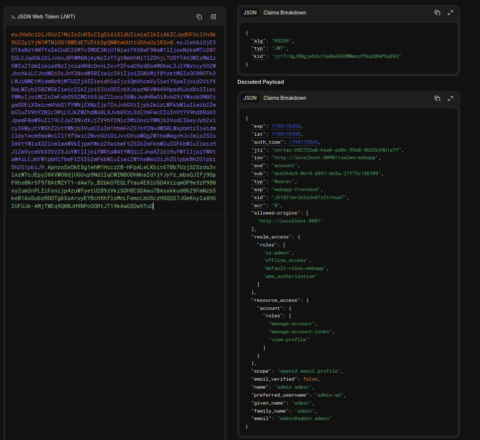

# Question 26 – Les claims de l'access token

Access token décodé avec [jwt.io](https://www.jwt.io) après une connexion avec l'utilisateur `admin-ad` :

Un JWT est composé de 3 parties séparées par des points : **header** . **payload** . **signature**.

## Header

| Claim | Valeur | Rôle |
|---|---|---|
| `alg` | `RS256` | Algorithme utilisé pour signer le token (RSA + SHA-256). |
| `typ` | `JWT` | Type du token. |
| `kid` | `jt1TrUg…` | Identifiant de la clé qui a signé le token. |

## Payload

### Validité dans le temps

Les dates sont des timestamps Unix (secondes depuis le 1er janvier 1970).

| Claim | Valeur | Rôle |
|---|---|---|
| `iat` | `1790176556` (17:15:56) | *Issued at* : date de création du token. |
| `exp` | `1790176856` (17:20:56) | *Expiration* : après cette date, le token doit être refusé. |
| `auth_time` | `1790176549` (17:15:49) | Moment où l'utilisateur a saisi son mot de passe. |

### Qui a émis le token, et pour qui

| Claim | Valeur | Rôle |
|---|---|---|
| `iss` | `http://localhost:8090/realms/webapp` | *Issuer* : le serveur (et le realm) qui a créé le token. |
| `aud` | `account` | *Audience* : le service auquel le token est destiné. |
| `azp` | `webapp-frontend` | Le client qui a demandé le token. |
| `allowed-origins` | `http://localhost:8081` | Origines autorisées à utiliser ce token depuis un navigateur (CORS). |
| `jti` | `onrtac:6027…` | Identifiant unique du token (utile pour le révoquer ou détecter un rejeu). |
| `typ` | `Bearer` | Type de token : quiconque le possède peut l'utiliser. |

### L'utilisateur

| Claim | Valeur | Rôle |
|---|---|---|
| `sub` | `dcb264c9-…` | *Subject* : identifiant unique et permanent de l'utilisateur dans Keycloak. |
| `preferred_username` | `admin-ad` | Nom d'utilisateur (c'est lui que notre API utilise pour trouver la balance). |
| `email`, `name`, `given_name`, `family_name` | `admin@admin.admin`, `admin admin`… | Informations de profil. |
| `email_verified` | `false` | L'email n'a pas été vérifié. |

### Session et droits

| Claim | Valeur | Rôle |
|---|---|---|
| `sid` | `JU1821mr…` | Identifiant de la session Keycloak. |
| `acr` | `0` | Niveau de confiance de l'authentification (plus il est élevé, plus la connexion est forte, par exemple avec la 2FA). |
| `scope` | `openid email profile` | Les informations auxquelles le token donne accès. |
| `realm_access.roles` | `is-admin`, … | Rôles de l'utilisateur dans le realm, dont le rôle `is-admin` créé à la question 10. |
| `resource_access` | `account` : `manage-account`, … | Rôles de l'utilisateur sur un client précis (ici la console de compte Keycloak). |

## Signature

La 3ᵉ partie est la signature du header et du payload, faite avec la clé privée de Keycloak.
Le payload n'est **pas chiffré** : n'importe qui peut le lire (comme jwt.io).
La signature garantit seulement qu'il n'a **pas été modifié** : changer `preferred_username` par exemple rendrait la signature invalide.
