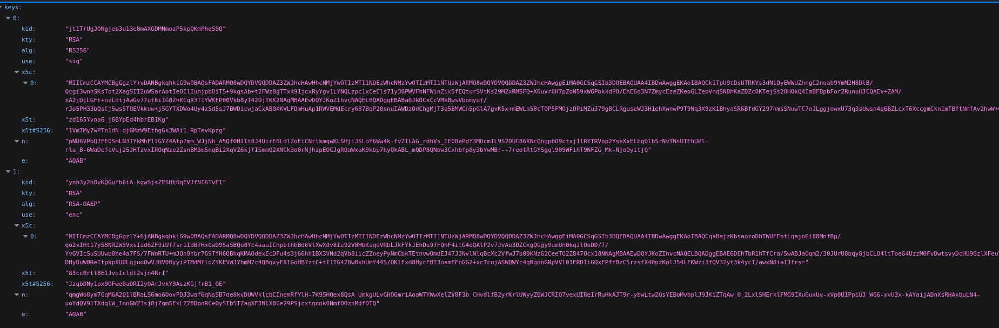

# Question 39 – Algorithme de la clé correspondant au `kid`

Liste des clés du realm `webapp` (JWKS), disponible sur
`http://localhost:8090/realms/webapp/protocol/openid-connect/certs` (port `8090` dans notre environnement) :

## Les clés du realm

| `kid` | `kty` | `alg` | `use` |
|---|---|---|---|
| **`jt1TrUg…PhqS9Q`** | RSA | RS256 | `sig` : signature |
| `ynh3y2h8…I6TvEI` | RSA | RSA-OAEP | `enc` : chiffrement |

La première clé a **le même `kid` que notre access token** (`jt1TrUgJONgjeb3u13e8mAXGDMNmozP5kpQKmPhqS9Q`, voir question 38) : c'est elle qui l'a signé.

## Réponse : algorithme **asymétrique**

- `kty: RSA` : c'est une clé RSA, un algorithme **asymétrique**.
- `alg: RS256` : signature RSA avec un hachage SHA-256.

Un algorithme asymétrique utilise **deux clés liées** :

| Clé | Qui la possède | Sert à |
|---|---|---|
| **Clé privée** | Keycloak uniquement (jamais publiée) | **signer** les tokens |
| **Clé publique** | tout le monde (publiée dans le JWKS) | **vérifier** la signature |

C'est pour ça que le JWKS peut être public : il ne contient que des clés publiques, qui permettent de vérifier une signature mais pas d'en fabriquer une.

## Que contient chaque clé du JWKS ?

| Champ | Contenu |
|---|---|
| `kid` | Identifiant de la clé. |
| `kty` | Type de clé (`RSA`). |
| `alg` | Algorithme à utiliser avec cette clé. |
| `use` | Usage : `sig` (signature) ou `enc` (chiffrement). |
| `n`, `e` | La clé publique RSA elle-même (le *modulus* et l'*exposant*). |
| `x5c` | La même clé publique, sous forme de certificat X.509. |
| `x5t`, `x5t#S256` | Empreinte (SHA-1 et SHA-256) de ce certificat. |

## Comparaison avec le refresh token

Le refresh token (question 30) est signé en `HS512` : un algorithme **symétrique**, où la même clé secrète sert à signer et à vérifier.
Cette clé n'apparaît donc **pas** dans le JWKS : la publier permettrait à n'importe qui de fabriquer des refresh tokens. Seul Keycloak peut vérifier un refresh token, et c'est voulu, puisqu'il est le seul à le recevoir.
