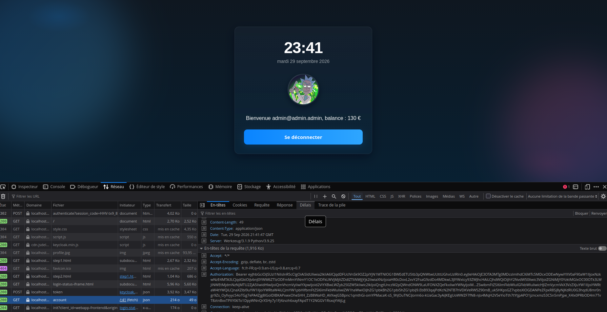

# Question 41 – Vérifier le JWT avec PyJWT et le JWKS

L'API ne demande plus à Keycloak si le token est valide (`/userinfo`) : elle vérifie elle-même la signature avec la clé publique du JWKS (voir questions 38 à 40).

## Installation

PyJWT est ajouté dans le `Dockerfile` de la webapp. L'option `[crypto]` installe la bibliothèque qui gère RSA, nécessaire pour `RS256` :

```dockerfile
RUN pip install flask python-keycloak pyjwt[crypto]
```

Puis reconstruction du conteneur : `docker compose up -d --build`.

## Le code (`webapp/app.py`)

**Client JWKS**, créé une seule fois au démarrage :

```python
server_url = os.getenv("KEYCLOAK_URL")
jwks_client = jwt.PyJWKClient(server_url + "/realms/webapp/protocol/openid-connect/certs")
```

Il télécharge la liste des clés publiques et la **garde en cache** : Keycloak n'est pas appelé à chaque requête.
L'URL utilise `KEYCLOAK_URL` (`http://keycloak:8080`), car depuis le conteneur Docker, Keycloak est joignable par le nom de son service.

**Vérification du token** dans `api_account` :

```python
try:
    signing_key = jwks_client.get_signing_key_from_jwt(token)
    payload = jwt.decode(
        token,
        signing_key.key,
        algorithms=["RS256"],
        audience="account",
        issuer="http://localhost:8090/realms/webapp",
    )
except jwt.PyJWTError:
    return {"error": "Invalid or expired token"}, 401

username = payload.get("preferred_username")
```

| Étape | Ce qui est vérifié |
|---|---|
| `get_signing_key_from_jwt(token)` | Lit le `kid` du header et récupère la clé publique correspondante dans le JWKS. |
| `signing_key.key` | La clé publique RSA elle-même. |
| `algorithms=["RS256"]` | Seul `RS256` est accepté : un token `alg: none` (sans signature) est refusé. |
| `audience="account"` | Le claim `aud` doit valoir `account`. |
| `issuer=…` | Le claim `iss` doit être exactement celui du realm `webapp`. C'est l'adresse vue par le navigateur (`localhost:8090`), pas celle du réseau Docker. |
| *(automatique)* | `exp` : PyJWT refuse les tokens expirés. |

Si une seule vérification échoue, PyJWT lève une exception (`jwt.PyJWTError`) et l'API répond `401`.
Sinon, `jwt.decode` renvoie le payload : on y lit `preferred_username` pour trouver la balance, comme avant avec `/userinfo`.

## Tests

**Test de bout en bout dans le navigateur** : après connexion, la page affiche la balance. Dans l'onglet Réseau, la requête `GET /api/account` part avec l'en-tête `Authorization: Bearer …` et reçoit une réponse `200`.



**Tests avec `curl`** :

| Test | Réponse |
|---|---|
| Sans token | `401` Missing or invalid Authorization header |
| Token bidon (`faux`) | `401` Invalid or expired token |
| Token non signé (`alg: none`) se faisant passer pour `admin-ad` | `401` Invalid or expired token |
| **Token valide** obtenu en se connectant | `200` `{"username": "admin-ad", "balance": 130.0}` |
| **Même token avec une lettre modifiée** dans le payload | `401` Invalid or expired token |

Le dernier test montre l'intérêt de la signature. Les deux derniers tokens ont le même `exp` et le premier est accepté : le refus ne vient donc pas de l'expiration. Il vient de la signature, qui ne correspond plus au payload modifié.

Pour ces vérifications, l'API n'a pas contacté Keycloak : elle a seulement utilisé la clé publique mise en cache.
