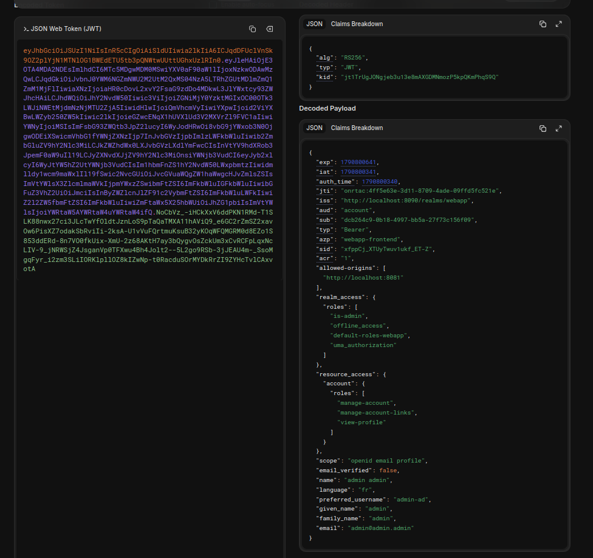

# Question 49 – Attribut personnalisé dans le JWT

## Configuration (questions 42 à 47)

| Étape | Réglage |
|---|---|
| Realm settings → *Unmanaged Attributes* | **Only administrators can write** : seul un administrateur peut modifier les attributs. |
| Users → `admin-ad` → *Attributes* | Ajout de l'attribut `language` = `fr`. |
| Clients → `webapp-backend` → *Client scopes* → `webapp-backend-dedicated` | Mapper *User attribute* : Name `language`, User attribute `language`, Token Claim Name `language`. |
| Clients → `webapp-frontend` → *Client scopes* → `webapp-frontend-dedicated` | **Même mapper, ajouté en plus** (voir remarque ci-dessous). |

## Résultat

Access token décodé avec jwt.io après déconnexion et reconnexion :



Le payload contient bien le nouveau claim :

```json
"language": "fr",
```

## Remarque : le mapper devait aussi être sur `webapp-frontend`

En suivant le sujet à la lettre (mapper uniquement sur `webapp-backend`), le claim **n'apparaissait pas** dans le token.

La raison : un mapper placé dans `<client>-dedicated` ne s'applique qu'aux tokens **demandés par ce client**. Or, dans notre application, le token est demandé par le frontend (keycloak-js avec `clientId: "webapp-frontend"`), comme l'indique le claim `azp: "webapp-frontend"`. Le client `webapp-backend`, lui, ne demande jamais de token : l'API se contente de vérifier ceux du frontend (question 41).

Le sujet indique que les mappers du client `webapp-backend` sont ajoutés à « chaque JWT généré par Keycloak » : c'est inexact, ils ne concernent que les JWT émis pour ce client. Il a donc fallu ajouter le même mapper sur `webapp-frontend` pour voir le claim.

## Pour aller plus loin

- **Autre solution** : créer un *Client scope* partagé (menu *Client scopes*) contenant le mapper, puis l'assigner aux clients qui en ont besoin. On évite ainsi de dupliquer le mapper.
- **Sécurité** : l'attribut est lisible par n'importe qui dans le JWT (Base64, pas chiffré), donc il ne faut pas y mettre de secret. Et comme il peut servir à l'application pour prendre des décisions, seul un administrateur doit pouvoir le modifier : c'est le rôle du réglage *Only administrators can write* de la question 42.
